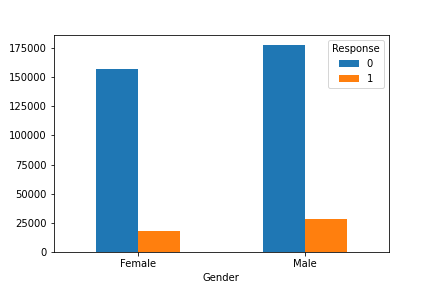

## Cross Sell Vehicle Insurance

An Insurance company has provided Health Insurance to its customers now they need to build a model to predict whether the policyholders (customers) from past year will also be interested in Vehicle Insurance provided by the company.

An insurance policy is an arrangement by which a company undertakes to provide a guarantee of compensation for specified loss, damage, illness, or death in return for the payment of a specified premium. A premium is a sum of money that the customer needs to pay regularly to an insurance company for this guarantee.

Just like medical insurance, there is vehicle insurance where every year customer needs to pay a premium of certain amount to insurance provider company so that in case of unfortunate accident by the vehicle, the insurance provider company will provide a compensation (called ‘sum assured’) to the customer.

Building a model to predict whether a customer would be interested in Vehicle Insurance is extremely helpful for the company because it can then accordingly plan its communication strategy to reach out to those customers and optimise its business model and revenue.

## Dataset Source
Kaggle

## Strategy
Its a classification problem. I have used 4 different models to achieve a AUC Score of 0.86.

## Data Visualization

   

   

   

   

   

## Results

   

XGboost has outperformed other ML models.
